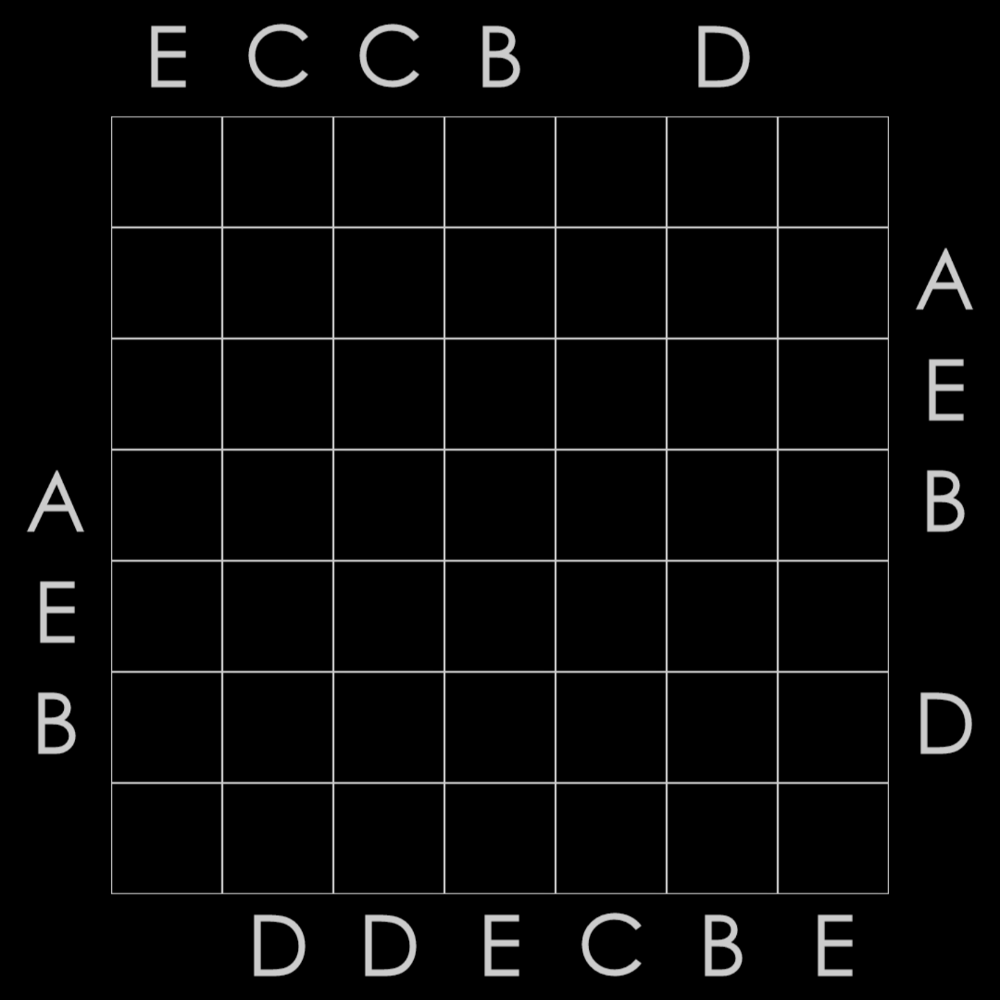
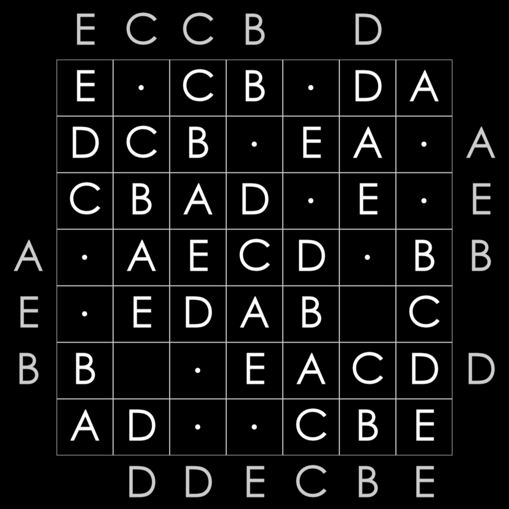
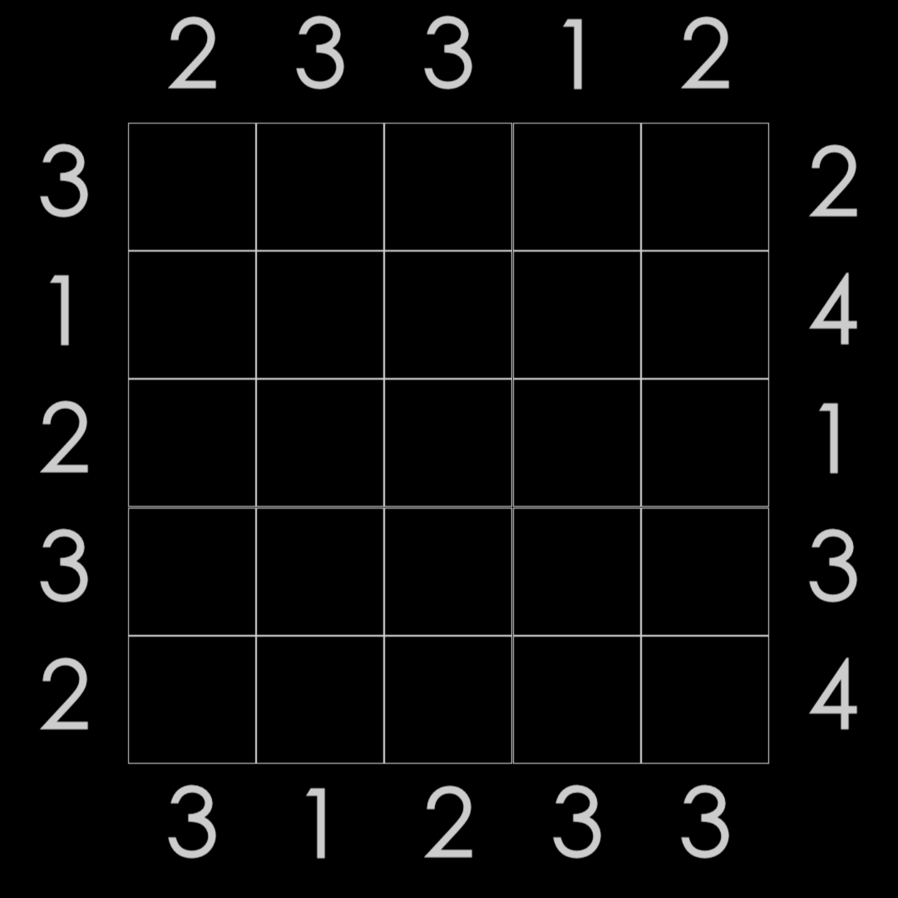
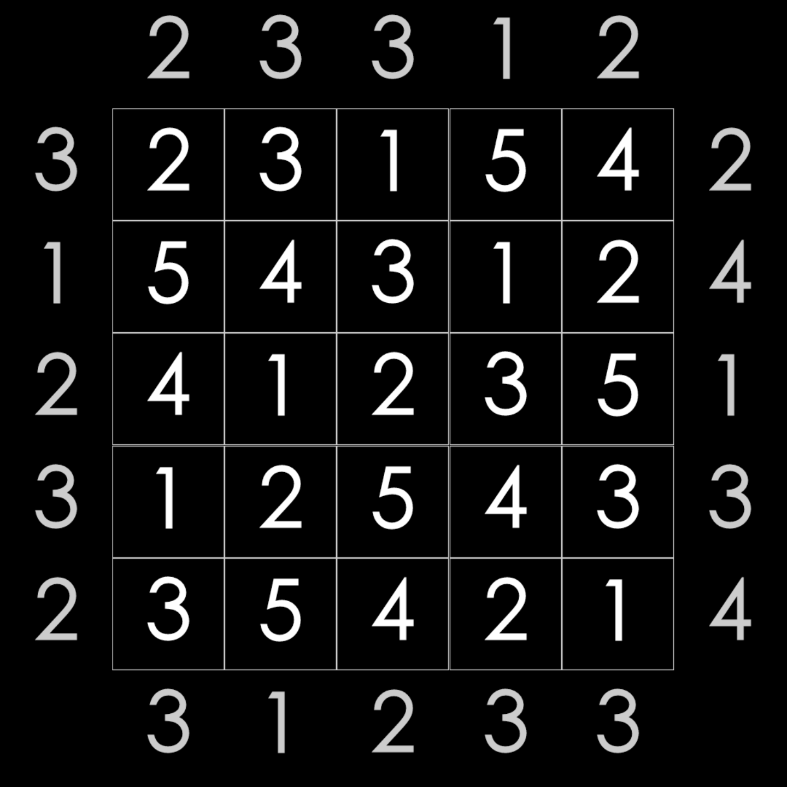

# LOGIC GAME SOLVERS

Reference puzzles from "100 Logic Games - Time Killers" app by Andrea Sabbatini

## :capital_abcd: Abc - Fill the board with ABC (Solved: 57/57) :heavy_check_mark:

The goal is to put the letters A, B and C in the board. 

### Rules :book:

Each letter appears once in every row and column and you're told which letter you see first from the border.
Since most puzzles can contain empty spaces, the hint on the border does not always match the tile next to it.

### Example :bar_chart:

  
Show

    
    

## :city_sunrise: Skyscrapers - Guess Skyscrapers from the Skyline (Solved: 7/30) :hourglass_flowing_sand:

The central grid represents a city, as seen from above. Each square contains a Skyscraper, of different height.
The goal is to guess the height of each Skyscraper.

### Rules :book:

Skyscrapers height ranges from 1 to the size of the city. Each row and column can't have two similar Skyscrapers.
Outside the city, on the borders, the numbers indicate the Skyline, which tells you how many Skyscrapers you can see from that side.
Keep in mind that a higher Skyscraper hides a lower one; also harder levels can hide some numbers.

### Example :bar_chart:

  
Show

    
    

